# Image Classification using AWS SageMaker
## This assignment is a part of AWS Machine Learning Engineer Nanodegree Program.

Using AWS Sagemaker to train a pretrained model Resnet50 to perform image classification by using the Sagemaker profiling, debugger, hyperparameter tuning
The following tasks are performed.
- Using a Resnet50 pretrained model from pytorch library(https://pytorch.org/vision/master/generated/torchvision.models.resnet50.html)
- Fine-tune the model with hyperparameter tuning
- Using the Sagemaker profiling, debugger
- Deploy the model and perform inference

## Project Set Up and Installation
Enter AWS through the gateway in the course and open SageMaker Studio. 
## Notebook Instance
Created notebook instance
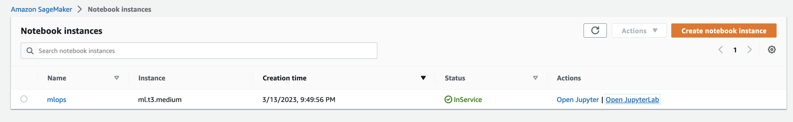
- I have used ml.t3.medium instance type for the Notebook instance.
- This instance type has 2vCPUs, 4GB menory and price of $0.05/hr.
- This instance types comes under Free Tier of AWS with 250 hours usage.
- Since my python notebook does not have any code that needs high computation or is long running, this type of instance works and is within budget.

Download the starter files.
Download/Make the dataset available. 
You can use this link to get the starter [files](https://github.com/udacity/CD0387-deep-learning-topics-within-computer-vision-nlp-project-starter)

## S3 Bucket
Created S3 Bucket
 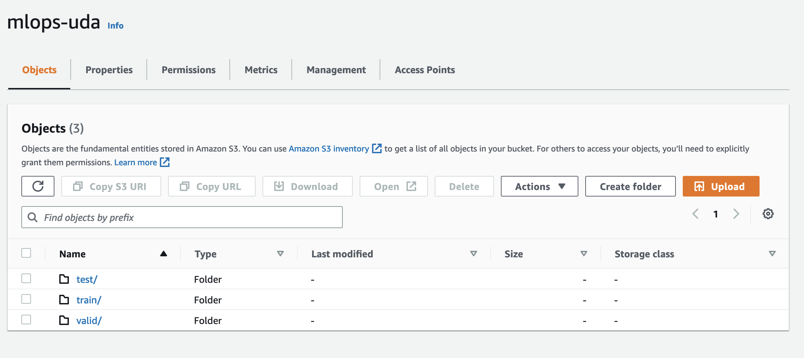
 Upload the Image data to S3 bucket

## Dataset
Udacity's Dog Breed Classification Data set is used.
The dataset can be downloaded [here](https://s3-us-west-1.amazonaws.com/udacity-aind/dog-project/dogImages.zip).

### Access
Upload the data to an S3 bucket through the AWS Gateway so that SageMaker has access to the data. 

## Files Used

- `train_and_deploy-solution.ipynb` it contains all step to upload data to s3, fine tunning, get best model hyperparameters, train the bestperformance model and test it , and make sagemaker profiling and debugger, and finally deploy the model and make an inference.

- `hpo.py` This is the python script using to train and test all models in tuning hyperparameters step.

- `ec2train1.py` This is the python script using to train the model in EC2 instance.

- `inference2.py` This script we use it to deploy the model on AWS and make prediction.

- `lambdafunction.py` This file contains the code for lambda function that gets inference from the model endpoint. The function contains the test event as well.

## Hyperparameter Tuning
- The Resnet50 used to learn the data because it is trained on a lot of data and it's concolution can get the general feature 
- One fully connected layer is used on top of resnet50 to predict 133 number of dog breed

### Single Instance
#### Single Instance Hyperparameter Training job
 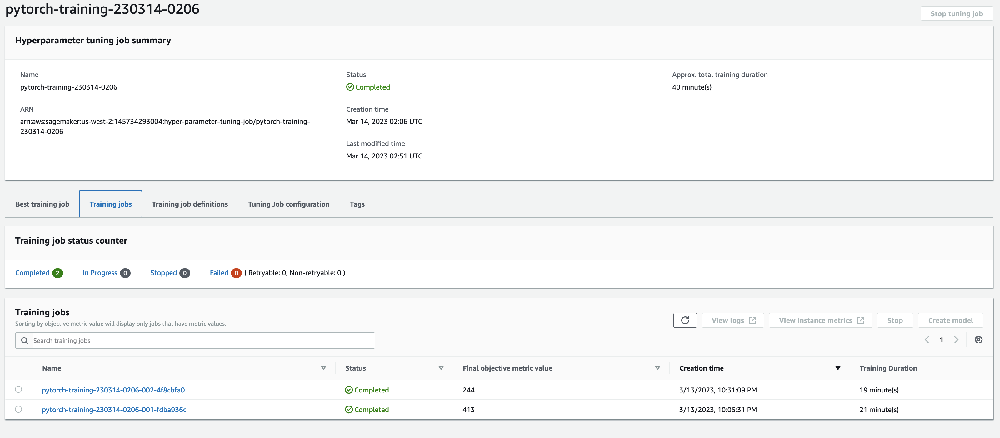
#### Single Instance Hyperparameter Training job Definition
 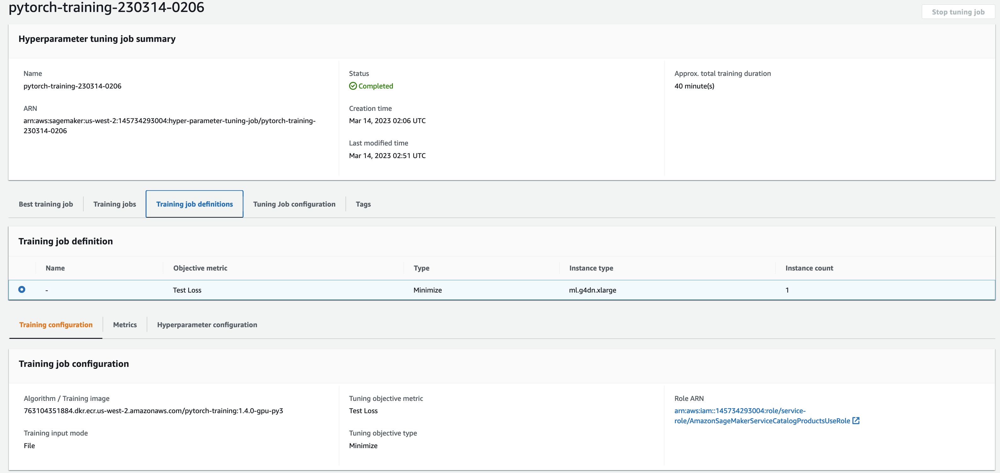
#### Single Instance Hyperparameter Best Training job  
 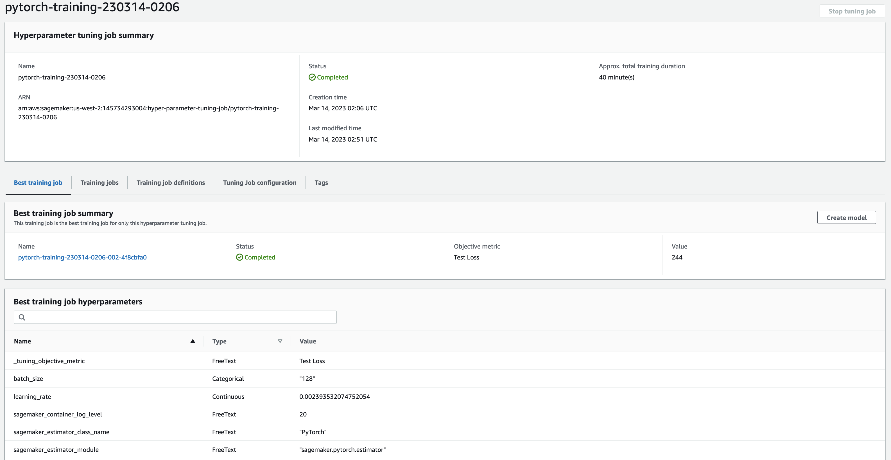

 
### Multi Instance 
#### Multi Instance Hyperparameter Training job
 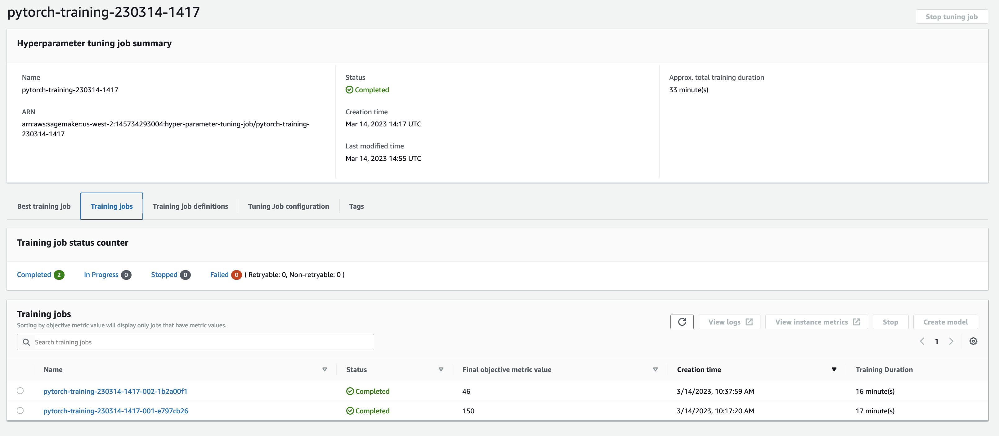
#### Multi Instance Hyperparameter Training job Definition
 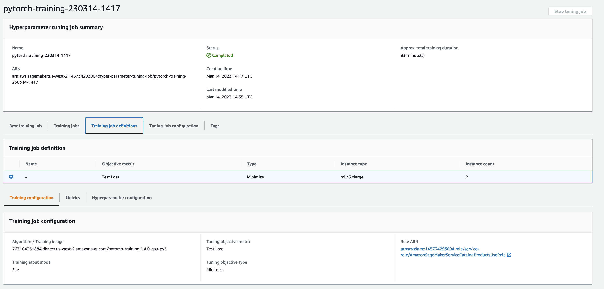
#### Multi Instance Hyperparameter Best Training job  
 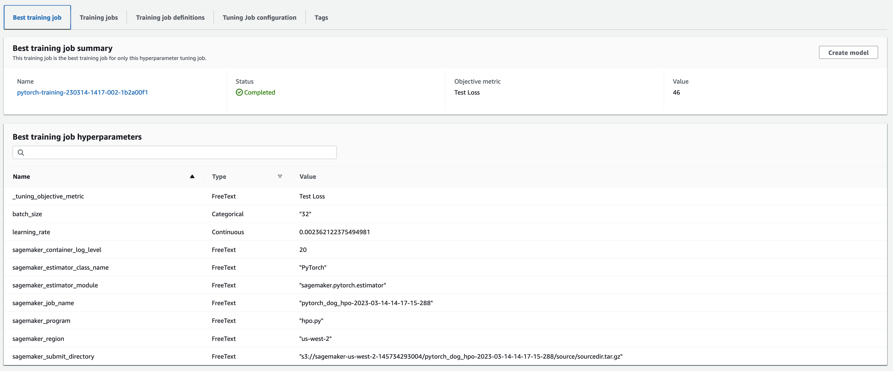

## Final Model Training
### Single Instance
 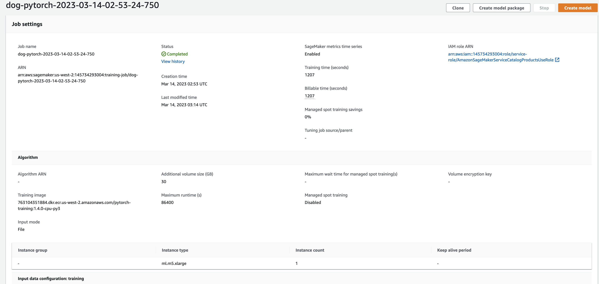
### Multi Instance
 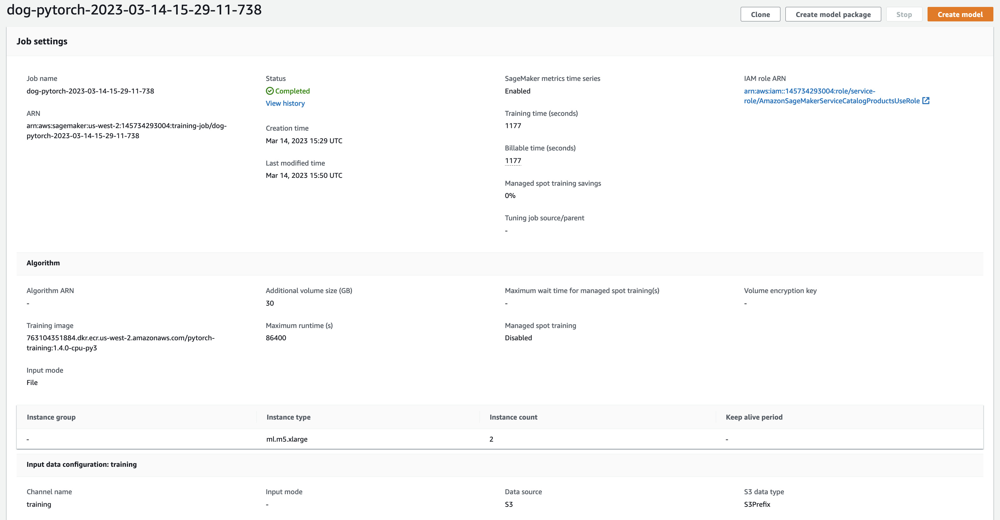

## Model Deployment
- Model was deployed to a "ml.m5.large" instance type and "infernce2.py" script is used to setup and deploy our working endpoint.
- For testing purposes ,one test images are stored in the "images" folder.
- image are fed to the endpoint for inference.

### Model Endpoint
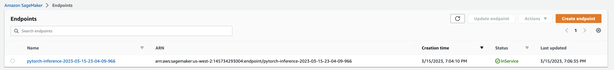

## Model Training on EC2 Instance
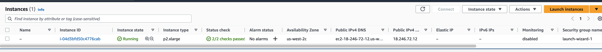
- To train a model on EC2 instance, image data need to be downloaded to EC2, however with Sagemkaker, data is stored in S3.
- Once the training is complete, the trained model is saved to EC2 as well, however with Sagemaker, model is stored in S3.
- With training on EC2, there is additional work for IT teams to manage EC2 infrastructure, which is managed by AWS when using Sagemaker.
- The On Demand EC2 instance type is p2.xlarge which comes with 4vCPUs, 61GB memory and high network performance with on demand hourly rate of $0.90/hr.
- The reason for choosing this instance type is that is has enough CPUs and memory to manage the image data. Training took a lot longer on this instance, but I had budget constraints so I used this instance. 

### Invoke Endpoint by Lambda Function
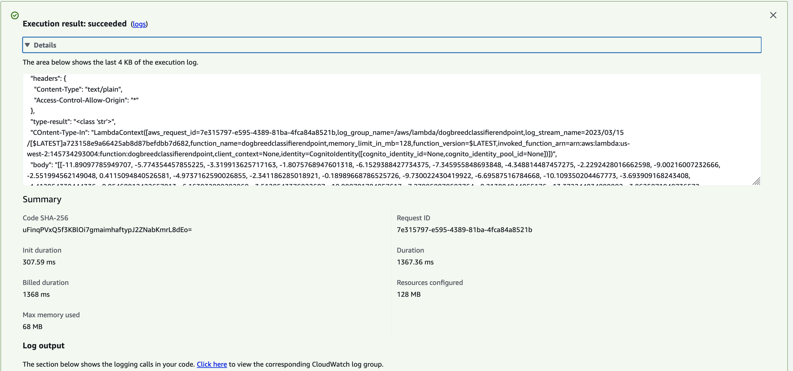

### Securing Lambda function and endpoint connection with IAM role
- For security measure, I only added the specific role to perform this task not Full Access to Sagemaker, so that to limit the access for lambda and limit any security vulnerabilities.
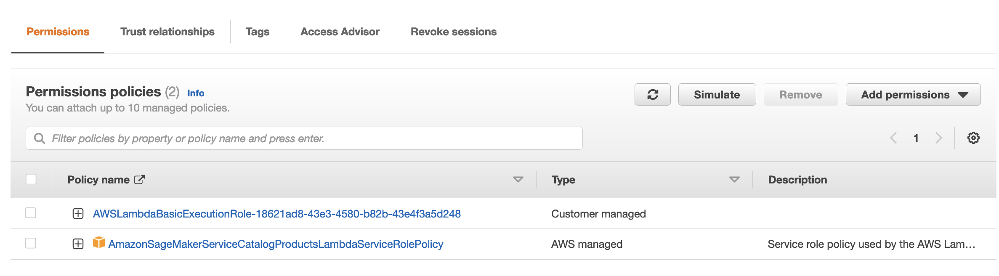

## High Throughput and Low Latency Handling (concurrency and auto-scaling)
- For Lambda concurrency I have chosen the Provisioned concurrency to make instances always on without requiring a wait for start-up time and that achieve low latency in high traffic and I have chosen to make 2 instance for concurrency.
- Provisioned Concurrency is calculated from the time its enabled on lambda function until it is disabled, rounded up to the nearest five minutes. The price depends on the amount of memory that is  allocate to lambda function (which is 128MB in our case) and the amount of concurrency configured on it. 
- Duration is calculated from the time lambda code begins executing until it returns or otherwise terminates, rounded up to the nearest 1ms**. 
- Since the lambda response is taking under 3s, lower provisioned concurrency works well. 

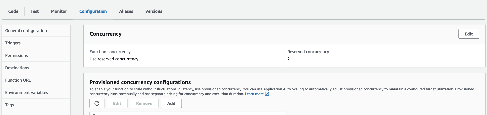

- For Endpoint Auto-Scaling I have used minimum of 1 instance and max of 3 instances.
- The Scaling In (reducing instances) occurs when the number of endpoint hits reduces from 10 at the same time for 2 mins, 
- The Scaling Out (increasing instances) occurs when the number of endpoint hits increase from 10 at the same time for 30seconds, 
- The endpoint instance type is ml.m5.large which has 2 vCPUs. 8GB Ram and price of $0.115 per hour
- This type of low costing instance works well within budget as well.

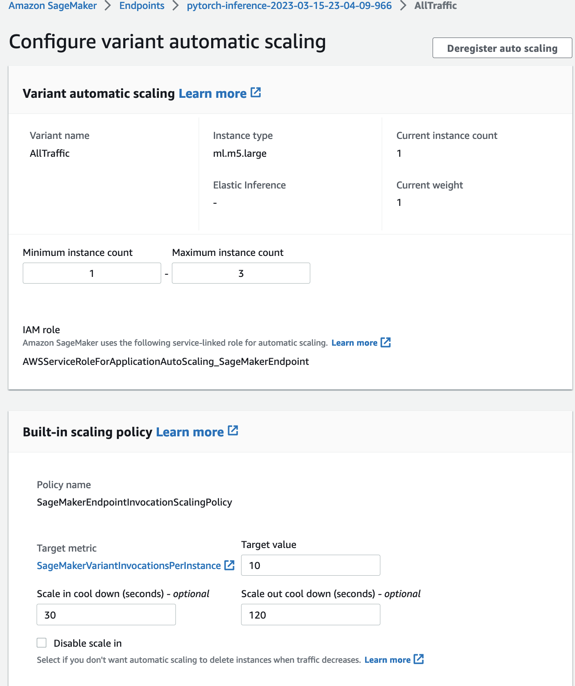

